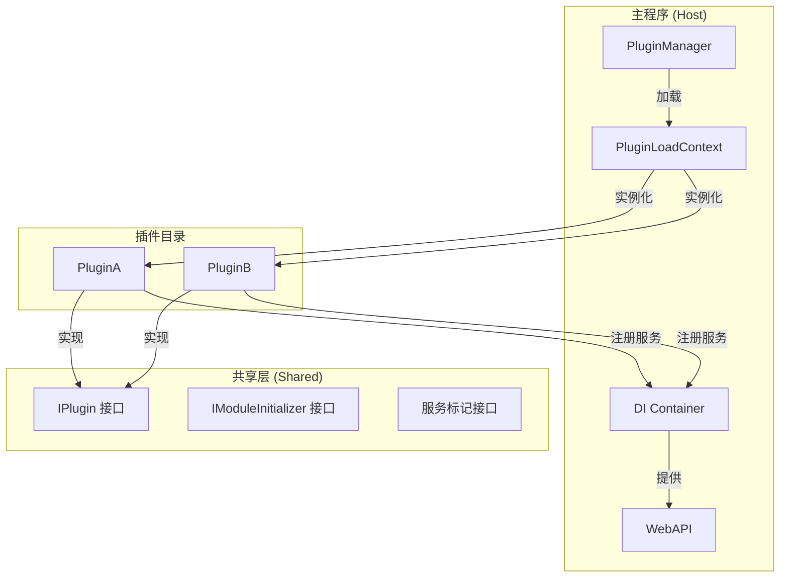
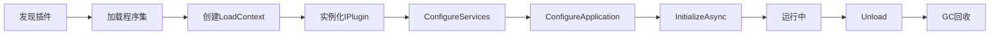

# C# 10 插件系统设计文档

## 1. 系统架构



## 2. 核心组件

### 2.1 AssemblyLoadContext
- 使用 .NET 原生的 `AssemblyLoadContext` 实现插件隔离
- 支持插件热卸载（`isCollectible: true`）
- 依赖解析器处理插件私有依赖

### 2.2 依赖注入
- 使用原生 DI 的模块化注册
- 服务标记接口：`IScopedService`, `ITransientService`, `ISingletonService`
- 插件可注册自己的服务到主容器

### 2.3 API 发现
- 使用 `AddApplicationPart()` 动态添加插件控制器
- 自定义 `IApplicationFeatureProvider` 发现插件控制器
- 命名约定：`*Controller` 自动识别

### 2.4 配置管理
- 每个插件独立的 `appsettings.json`
- 支持环境配置 `appsettings.{env}.json`
- 配置热重载支持

## 3. 项目结构

```
MyPluginSystem/
├── src/
│   ├── Host/                         # 主程序
│   │   ├── Program.cs
│   │   ├── appsettings.json
│   │   └── Host.csproj
│   ├── Shared/                       # 共享接口
│   │   ├── Contracts/
│   │   │   ├── IPlugin.cs
│   │   │   ├── IModuleInitializer.cs
│   │   │   └── ServiceInterfaces.cs
│   │   └── Shared.csproj
│   └── Plugins/                      # 插件目录
│       ├── PluginA/
│       │   ├── PluginA.cs
│       │   ├── Controllers/
│       │   ├── Services/
│       │   ├── appsettings.json
│       │   └── PluginA.csproj
│       └── PluginB/
│           ├── PluginB.cs
│           ├── Controllers/
│           ├── Services/
│           ├── appsettings.json
│           └── PluginB.csproj
├── docker-compose.yml
├── .gitignore
└── README.md
```

## 4. 接口清单

### Host API
| 方法 | 路径 | 描述 |
|------|------|------|
| GET | /api/plugins | 获取已加载插件列表 |
| GET | /api/plugins/{name} | 获取插件详情 |
| POST | /api/plugins/{name}/reload | 重新加载插件 |

### PluginA API (示例：计算器插件)
| 方法 | 路径 | 描述 |
|------|------|------|
| POST | /api/calculator/add | 加法运算 |
| POST | /api/calculator/subtract | 减法运算 |
| POST | /api/calculator/multiply | 乘法运算 |
| POST | /api/calculator/divide | 除法运算 |

### PluginB API (示例：问候插件)
| 方法 | 路径 | 描述 |
|------|------|------|
| GET | /api/greeting/{name} | 获取问候语 |
| GET | /api/greeting/languages | 获取支持的语言列表 |
| POST | /api/greeting | 自定义问候语 |

## 5. 插件生命周期



## 6. 技术规格

- **运行时**: .NET 8.0
- **语言**: C# 12 (向下兼容 C# 10)
- **依赖注入**: Microsoft.Extensions.DependencyInjection
- **Web框架**: ASP.NET Core 8.0
- **API文档**: Swagger/OpenAPI
